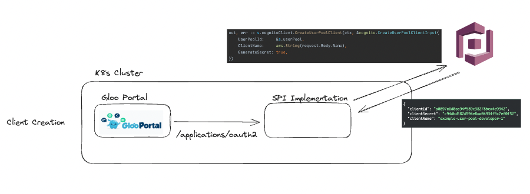
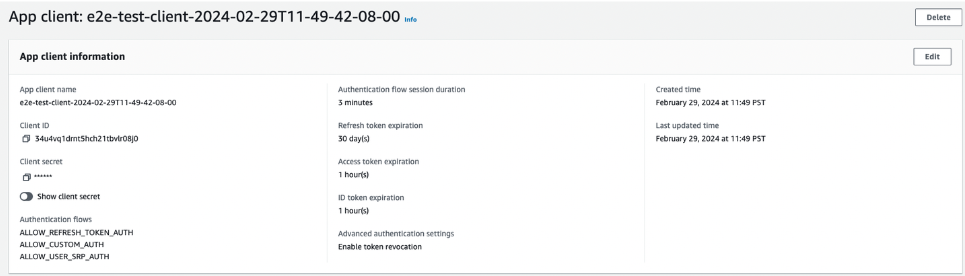
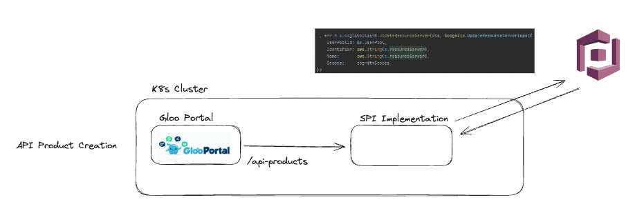
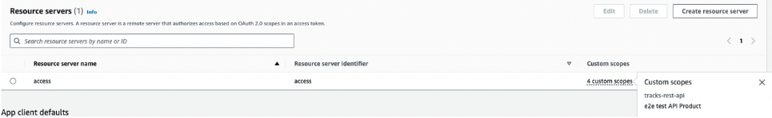
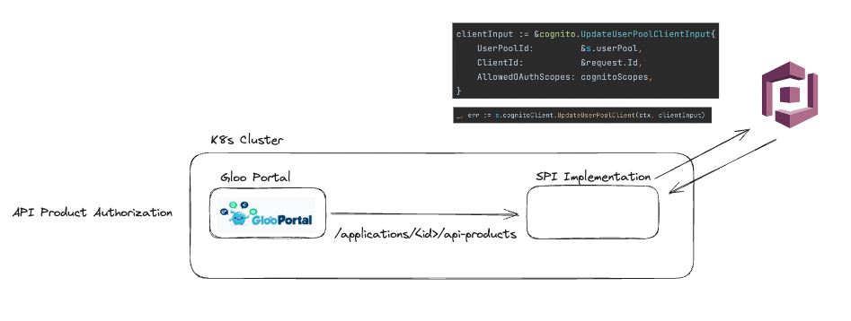
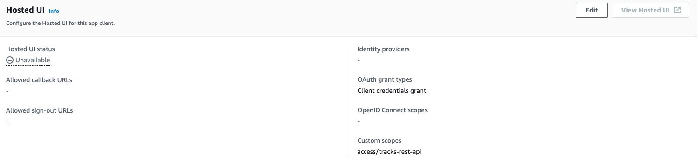
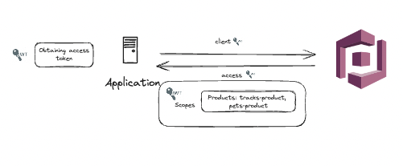
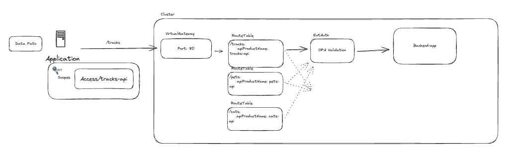

# Use with Gloo Platform

The idea behind the Service Programming Interface is to provide an interopability layer between Gloo Platform Portal and the IDP that the customer wants to use. In order to get the desired functionality, there are two flows that need to be implemented: IDP Configuration and Data Path Authorization.

## AWS Cognito Example

### IDP Configuration



When an application is created in Gloo Portal, the SPI will be called to create the client representation in the SPI. The Client ID and Secret can then be used to create the access_token via Cognito's token endpoint.



A client is created in AWS Cognito. The expectation is that the OAuth flow type "client_credentials" is selected so that an access token can be created from the client id and secret. This, however, is a decision that the customer can make to decide how credentials are managed and tokens are distributed.



When an API Product is created in Gloo Portal, the SPI will be called to create the representation in the IDP. For Cognito, this would most likely be represented as a resource server:



For Cognito clients which have been given a custom scope via this resource server, the scope will take the form `<resource-server>/<custom-scope>`. In this diagram, it would be `access/tracks-rest-api`. Below, we will discuss how this can be used on the data path to authorize a request to your API Product.



Once an Application and API Product is in the system, you can begin to authorize API Products for particular applications.



Once the API Product has been given access to the application, you can see that the custom scope is included in the client's "Hosted UI" section.

### Data Path Authorization



Cognito's token endpoint can be used to retrieve the access token. See [Configuring Gloo Platform](./configuring-gloo-platform.md) for more information on how to use the access token to authorize requests to your API Products.



The Access token can be used to authorize requests via ext-auth. The most convenient method would be to use OPA in order to match the scope of the access token against the `apiProductId` of the API Product. See [Configuring Gloo Platform](./configuring-gloo-platform.md) for more information on how to use the access token to authorize requests to your API Products.

## Keycloak Example

### IDP Configuration

When an application is created in Gloo Portal, the SPI will be called to create the client representation in the SPI. This will result in a new client created in the Keycloak realm, with an auto-generated client ID and secret returned to the caller.

> **Note:** Clients created by the SPI use Keycloak's default settings, and no assumptions are made about how the client will manage and distribute tokens. It is left to the customer to decide how the created clients should be configured.

When an API Product is created in Gloo Portal, the SPI will be called to create the representation in the IDP. For Keycloak, this would most likely be represented as a _resource_ managed by the _resource server_ client. For convenience, the default implementation assumes that the client being used by the SPI to manage applications is also the resource server that will manage API products.

Once at least one Application (client) and one API Product (resource) is in the system, you can begin to authorize API Products for particular applications. This can be represented in Keycloak as a permission granted on the API product resource to the client application.

Once the API Product has been given access to the application, the application can request a permission token from Keycloak's token endpoint.

### Data Path Authorization

The client will need to use Keycloak's token endpoint to obtain a Requesting Party Token (RPT) on the user's behalf. _The resource server client ID (i.e. the client ID used by the SPI itself, must be specified as the `audience` in the token request for the correct permissions to be evaluated._ The access token returned will contain a new `authorization` claim with permissions for the permitted API products:

```json
"authorization": {
  "permissions": [
    {
      "rsid": "aa6edf59-a4b7-4532-b6b1-a5b423da7809",
      "rsname": "bookinfo"
    }
  ]
}
```

See <https://www.keycloak.org/docs/latest/authorization_services/index.html#_service_obtaining_permissions> for more details on obtaining an RPT.

The RPT can be used to authorize requests via ext-auth. The most convenient method would be to use OPA in order to match the token's permissions against the `apiProductId` of the API Product. See [Configuring Gloo Platform](./configuring-gloo-platform.md) for more information on how to use the access token to authorize requests to your API Products.
